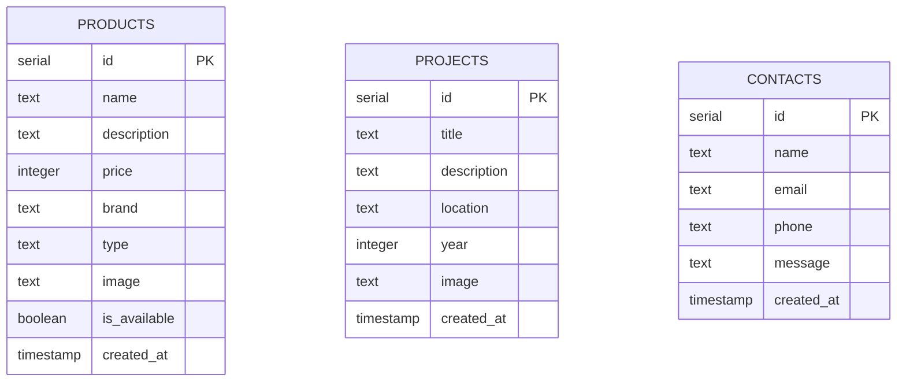

# 🗄️ Database Design - Điện Máy Trần Điền SaaS

Tài liệu này chi tiết hóa cấu trúc thiết kế cơ sở dữ liệu, định nghĩa bảng, chỉ mục và các mối quan hệ thực thể sử dụng trong dự án Điện Máy Trần Điền kết nối tới Supabase Postgres thông qua Drizzle ORM.

## 📊 Mô hình các bảng Cơ sở dữ liệu

Hiện tại hệ thống cơ sở dữ liệu có 3 bảng chính phục vụ cho các thực thể độc lập:

---

## 📝 Chi tiết định nghĩa bảng (Schema Definitions)

### 1. Bảng `products` (Danh mục Thiết bị - Sản phẩm)
*   **Mô tả**: Lưu trữ thông tin chi tiết các sản phẩm như máy lạnh Nagakawa, Panasonic, máy bơm nước ngưng Kingpump, quạt chắn gió Nedfon...
*   **Chi tiết các trường**:

| Tên trường (TypeScript) | Tên cột (Postgres) | Kiểu dữ liệu | Thuộc tính | Mô tả |
| :--- | :--- | :--- | :--- | :--- |
| `id` | `id` | `serial` | Primary Key | Định danh tăng tự động của sản phẩm |
| `name` | `name` | `text` | Not Null | Tên sản phẩm thiết bị |
| `description` | `description` | `text` | Nullable | Mô tả chi tiết tính năng, thông số |
| `price` | `price` | `integer` | Default `0`, Not Null | Giá tiền sản phẩm (VND) |
| `brand` | `brand` | `text` | Not Null | Thương hiệu (Daikin, Panasonic, Nagakawa, Kingpump...) |
| `type` | `type` | `text` | Not Null | Loại sản phẩm (Treo tường, Âm trần, Máy bơm, Quạt chắn gió...) |
| `image` | `image` | `text` | Nullable | Link ảnh minh họa sản phẩm |
| `isAvailable` | `is_available` | `boolean` | Default `true`, Not Null | Trạng thái còn hàng hay hết hàng |
| `createdAt` | `created_at` | `timestamp` | Default `Now()`, Not Null | Thời điểm tạo sản phẩm |

---

### 2. Bảng `projects` (Các Công trình Thực tế)
*   **Mô tả**: Lưu trữ thông tin và hình ảnh thực tế các dự án, công trình mà Điện Máy Trần Điền đã trực tiếp thi công lắp đặt hệ thống máy lạnh, quạt chắn gió.
*   **Chi tiết các trường**:

| Tên trường (TypeScript) | Tên cột (Postgres) | Kiểu dữ liệu | Thuộc tính | Mô tả |
| :--- | :--- | :--- | :--- | :--- |
| `id` | `id` | `serial` | Primary Key | Định danh tăng tự động của dự án |
| `title` | `title` | `text` | Not Null | Tiêu đề dự án công trình |
| `description` | `description` | `text` | Nullable | Mô tả quy mô, danh sách thiết bị thi công |
| `location` | `location` | `text` | Not Null | Địa điểm thi công (Ví dụ: TP.HCM, Bình Dương...) |
| `year` | `year` | `integer` | Not Null | Năm hoàn thành dự án |
| `image` | `image` | `text` | Nullable | Link ảnh thực tế công trình hoàn thiện |
| `createdAt` | `created_at` | `timestamp` | Default `Now()`, Not Null | Thời điểm tạo bản ghi công trình |

---

### 3. Bảng `contacts` (Biểu mẫu Tư vấn Khách hàng)
*   **Mô tả**: Lưu trữ các yêu cầu tư vấn, thông tin liên hệ được khách hàng chủ động gửi từ biểu mẫu liên hệ tại trang chủ.
*   **Chi tiết các trường**:

| Tên trường (TypeScript) | Tên cột (Postgres) | Kiểu dữ liệu | Thuộc tính | Mô tả |
| :--- | :--- | :--- | :--- | :--- |
| `id` | `id` | `serial` | Primary Key | Định danh tăng tự động của liên hệ |
| `name` | `name` | `text` | Not Null | Họ và tên khách hàng cần tư vấn |
| `email` | `email` | `text` | Not Null | Địa chỉ email liên lạc |
| `phone` | `phone` | `text` | Not Null | Số điện thoại khách hàng (Dùng để gọi tư vấn trực tiếp) |
| `message` | `message` | `text` | Not Null | Nội dung yêu cầu tư vấn cụ thể của khách hàng |
| `createdAt` | `created_at` | `timestamp` | Default `Now()`, Not Null | Thời điểm khách hàng gửi biểu mẫu |
