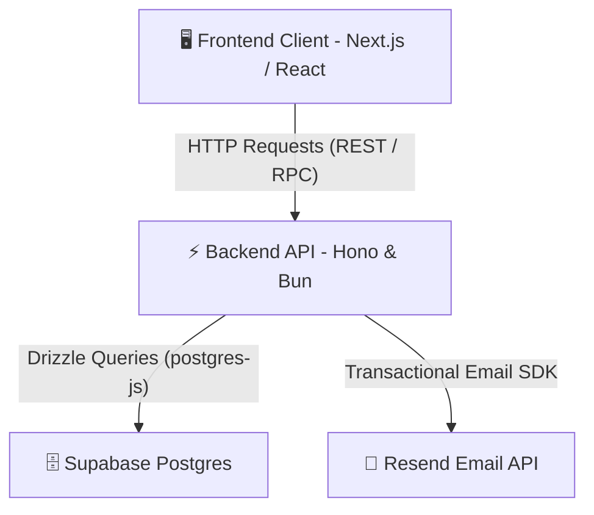

# 🏗️ System Overview - Điện Máy Trần Điền SaaS

Tài liệu này cung cấp cái nhìn tổng quan về kiến trúc hệ thống, luồng dữ liệu và sự kết hợp công nghệ giữa Frontend, Backend và Cơ sở dữ liệu của dự án Điện Máy Trần Điền.

## 🗺️ Mô hình kiến trúc tổng quát
Hệ thống được thiết kế theo mô hình **Client-Server** hiện đại, sẵn sàng tích hợp môi trường Serverless hoặc ảo hóa Docker:

## ⚙️ Chi tiết các thành phần công nghệ

### 1. Frontend Client (Next.js / React)
*   **Vị trí**: Nằm tại thư mục Frontend.
*   **Công nghệ**: Next.js, TailwindCSS, GSAP.
*   **Nhiệm vụ**: Trình diễn giao diện người dùng, xử lý các hiệu ứng động mượt mà (GSAP Preloader, Masonry Grid), tương tác và gửi dữ liệu yêu cầu tư vấn, lọc danh mục sản phẩm.

### 2. Backend API Server (Hono & Bun)
*   **Vị trí**: Nằm tại thư mục `Backend/`.
*   **Công nghệ**: Bun runtime, Hono Framework, Zod.
*   **Nhiệm vụ**: Tiếp nhận, sàng lọc (validation) các yêu cầu từ Client, thực hiện các logic nghiệp vụ (quản lý sản phẩm, lưu liên hệ, lọc công trình), tương tác an toàn với database và chuyển đổi kết nối linh hoạt.

### 3. Database Cloud (Supabase Postgres)
*   **Vị trí**: Nền tảng đám mây Supabase (khu vực aws-1-ap-southeast-2).
*   **Công nghệ**: PostgreSQL, Supavisor Connection Pooler (Cổng 6543).
*   **Nhiệm vụ**: Lưu trữ vững chắc danh mục sản phẩm thiết bị, danh sách công trình thi công, và thông tin biểu mẫu tư vấn của khách hàng.

---

## 🔄 Luồng dữ liệu chính trong hệ thống

### Luồng 1: Xem danh mục sản phẩm & Công trình (Read-Only)
1.  Người dùng truy cập vào trang chủ hoặc trang sản phẩm trên **Frontend**.
2.  Frontend gửi yêu cầu `GET /api/products` hoặc `GET /api/projects` tới **Backend Hono**.
3.  **Backend Hono** thực hiện câu lệnh truy vấn qua **Drizzle ORM** tới **Supabase Postgres**.
4.  Dữ liệu trả về qua tầng ORM dưới dạng JSON và chuyển tiếp lại cho **Frontend** hiển thị mượt mà.

### Luồng 2: Gửi thông tin tư vấn liên hệ (Write-Only)
1.  Khách hàng nhập thông tin (Tên, Email, Sđt, Lời nhắn) tại **Frontend Form** và nhấn gửi.
2.  Frontend gửi yêu cầu `POST /api/contact` kèm payload dạng JSON tới **Backend**.
3.  **Hono Middleware** xác thực dữ liệu đầu vào bằng **Zod Schema**. Nếu không hợp lệ, phản hồi ngay lỗi `400 Bad Request`.
4.  Nếu dữ liệu sạch, **Drizzle ORM** tiến hành chèn một bản ghi mới vào bảng `contacts` trong **Supabase**.
5.  Backend kích hoạt **Resend Email API** gửi thông báo về hộp thư Admin và gửi email xác nhận cho khách hàng.
6.  Trả về mã phản hồi thành công `201 Created` cho **Frontend** hiển thị thông báo chúc mừng.
