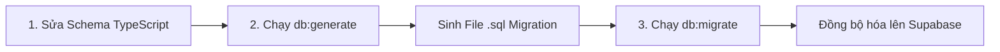

# 🔄 Database Migrations - Quản trị Thay đổi Cơ sở dữ liệu

Tài liệu này hướng dẫn chi tiết quy trình thay đổi cấu trúc bảng, đồng bộ hóa cơ sở dữ liệu lên đám mây và xử lý cấu hình Connection Pooling tối ưu cho Supabase Postgres bằng Drizzle-Kit.

## ⚙️ Quy trình Migration bằng Drizzle-Kit

Mọi sự thay đổi về cấu trúc bảng (thêm bảng, xóa bảng, đổi tên cột, thêm ràng buộc...) đều được quản lý tự động, an toàn thông qua 2 bước cốt lõi:



### Bước 1: Thay đổi cấu trúc bảng trong mã nguồn
Chỉnh sửa hoặc thêm các định nghĩa bảng trực tiếp bằng mã nguồn TypeScript tại tệp [src/db/schema.ts](file:///c:/Users/dandi/OneDrive/Desktop/Untitled Export/50226/Backend/src/db/schema.ts).

### Bước 2: Sinh tệp SQL Migration (`db:generate`)
Chạy lệnh sau để Drizzle-Kit tự động đối chiếu các tệp TypeScript với lịch sử database, từ đó sinh ra tệp mã lệnh SQL tương thích đặt tại `drizzle/`:
```bash
npm run db:generate
```
Tệp SQL mới có dạng ví dụ: `drizzle/0001_add_articles_table.sql`.

### Bước 3: Áp dụng thay đổi lên Cơ sở dữ liệu vật lý (`db:migrate`)
Chạy lệnh sau để thực thi tệp SQL migration và cập nhật trực tiếp cấu trúc bảng lên tài khoản cơ sở dữ liệu Supabase của bạn:
```bash
npm run db:migrate
```

---

## ⚡ Cấu hình Connection Pooling đặc thù của Supabase

Supabase sử dụng **Supavisor** làm dịch vụ Connection Pooler để tối ưu số lượng kết nối đồng thời từ máy chủ API. Để Drizzle hoạt động an toàn và không bị lỗi, bạn **bắt buộc** phải tuân thủ các chỉ thị cấu hình sau:

### 1. Phân tách cổng Direct (5432) và Pooler (6543)
*   **Chạy Migrations (Cổng `5432` hoặc `6543` chế độ Session)**: Drizzle Kit yêu cầu kết nối trực tiếp để thực hiện thay đổi cấu trúc bảng. Sử dụng cổng `5432` hoặc chuỗi kết nối Session trong file `.env` khi chạy lệnh `npm run db:migrate`.
*   **Chạy Ứng Dụng (Cổng `6543` chế độ Transaction)**: Máy chủ API nhận hàng triệu request truy cập đồng thời nên bắt buộc sử dụng cổng Connection Pooler `6543` chế độ Transaction để tránh làm cạn kiệt kết nối vật lý của Postgres.

### 2. Cú pháp kết nối bắt buộc trong [src/db/index.ts](file:///c:/Users/dandi/OneDrive/Desktop/Untitled Export/50226/Backend/src/db/index.ts)
Vì Supavisor ở chế độ Transaction không hỗ trợ tính năng chuẩn bị câu truy vấn trước (Prepared Statements), ta phải thiết lập thuộc tính `{ prepare: false }` khi khởi tạo kết nối:

```typescript
import postgres from "postgres";
import { drizzle } from "drizzle-orm/postgres-js";
import * as schema from "./schema.js";

const databaseUrl = process.env.DATABASE_URL || "";

// Cực kỳ quan trọng: { prepare: false } giúp ngăn ngừa lỗi Prepared Statements khi kết nối qua Pooler của Supabase
const client = postgres(databaseUrl, { prepare: false });
export const db = drizzle(client, { schema });
```

> [!WARNING]
> Nếu bạn thiếu cấu hình `{ prepare: false }` khi chạy ứng dụng trên môi trường thực tế với cổng Pooler `6543`, máy chủ API sẽ bị crash ngay lập tức sau vài lượt truy vấn dữ liệu liên tục do lỗi xung đột định danh prepared statements trong PostgreSQL!
