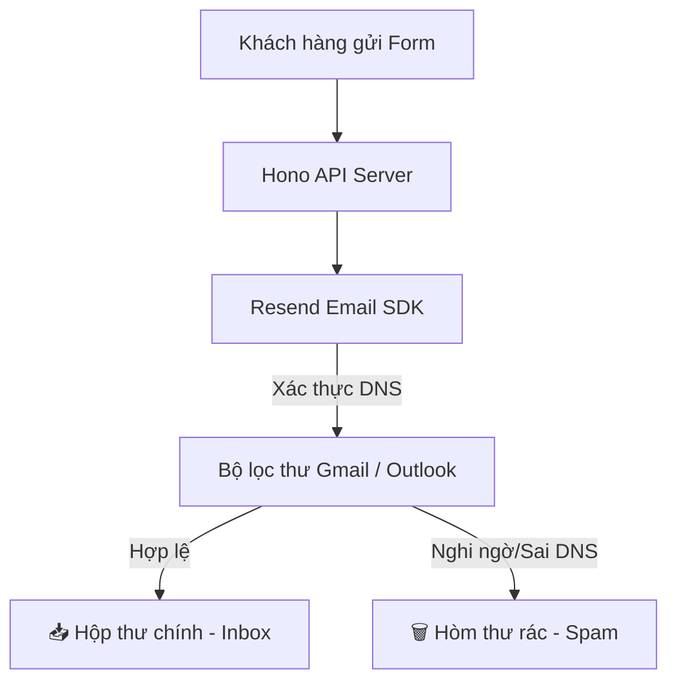

# 📧 Email Infrastructure - Thiết lập hạ tầng Email giao dịch tin cậy

Tài liệu này hướng dẫn chi tiết cách cấu hình hạ tầng gửi email giao dịch thông qua Resend API kết hợp các bản ghi bảo mật DNS nhằm tối ưu tỷ lệ email vào hộp thư chính (Inbox) 100% của khách hàng.

## 🚀 1. Tổng quan quy trình gửi Email giao dịch
Khi khách hàng gửi yêu cầu tư vấn tại trang chủ, hệ thống sẽ kích hoạt một tiến trình gửi thư tự động:

---

## 🔒 2. Thiết lập Bản ghi Bảo mật DNS trên Tên miền (`dienmaytrandien.com`)

Để đảm bảo các nhà mạng email như Google (Gmail), Microsoft (Outlook) tin tưởng email gửi từ hệ thống của bạn và không đánh dấu thư rác, bạn **bắt buộc** phải truy cập trang quản trị tên miền của mình và cấu hình đầy đủ 3 bản ghi bảo mật sau:

### 1. Bản ghi SPF (Sender Policy Framework)
*   **Mô tả**: SPF định nghĩa danh sách các máy chủ được phép đại diện tên miền của bạn gửi email đi.
*   **Loại bản ghi**: `TXT`
*   **Tên (Host)**: `@`
*   **Giá trị**: `v=spf1 include:amazonses.com ~all` *(Resend sử dụng hạ tầng AWS SES bên dưới)*.

### 2. Bản ghi DKIM (DomainKeys Identified Mail)
*   **Mô tả**: DKIM sử dụng chữ ký số mã hóa khóa công khai để đảm bảo email gửi đi không bị can thiệp, chỉnh sửa nội dung trên đường truyền tải.
*   **Loại bản ghi**: `CNAME` (Resend sẽ cung cấp cho bạn 3 bản ghi DKIM cụ thể trong bảng điều khiển).
*   **Ví dụ**:
    *   Host: `resend1._domainkey.dienmaytrandien.com` | Value: `resend1.dkim.resend.com`
    *   Host: `resend2._domainkey.dienmaytrandien.com` | Value: `resend2.dkim.resend.com`

### 3. Bản ghi DMARC (Domain-based Message Authentication, Reporting, and Conformance)
*   **Mô tả**: DMARC hướng dẫn nhà mạng email nhận thư (như Gmail) cách xử lý khi email gửi đi không vượt qua được bài kiểm tra SPF hoặc DKIM (ví dụ: bị kẻ xấu mạo danh).
*   **Loại bản ghi**: `TXT`
*   **Tên (Host)**: `_dmarc`
*   **Giá trị**: `v=DMARC1; p=quarantine; pct=100; rua=mailto:dmarc-reports@dienmaytrandien.com`
    *   `p=quarantine`: Đưa thư nghi ngờ mạo danh vào hòm thư rác/quarantine.
    *   `pct=100`: Áp dụng cho 100% lượng email gửi đi.

---

## 🛠️ 3. Quy trình cấu hình trên Resend Dashboard

1.  **Đăng ký tài khoản**: Truy cập [Resend.com](https://resend.com/) và tạo tài khoản.
2.  **Thêm Tên miền**: Đi tới **Domains** > **Add Domain** > Điền tên miền `dienmaytrandien.com`.
3.  **Xác minh DNS**: Resend sẽ cung cấp danh sách các bản ghi SPF và DKIM. Sao chép và dán chính xác các bản ghi này vào trình quản lý DNS của nhà cung cấp tên miền của bạn (ví dụ: Cloudflare, Mắt Bão, Nhân Hòa).
4.  **Xác nhận hoàn thành**: Nhấn **Verify** trong Resend. Khi trạng thái chuyển sang màu xanh **Verified**, bạn đã sẵn sàng gửi email thương hiệu cá nhân hóa chuyên nghiệp!
